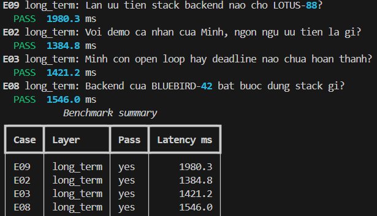
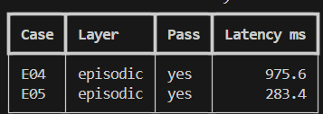
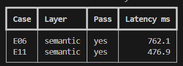
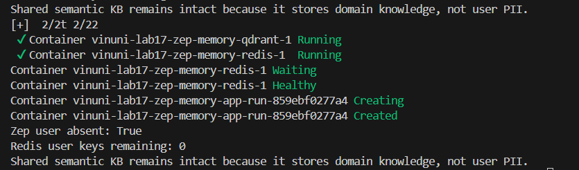

# README Submission - Lab 17 (Zep Memory Agent)

**Họ và tên:** Nguyễn Văn Hiệp  
**MSV:** 2A202601488

## 1. Phân tích Benchmark (4 câu)

**1. Layer nào có hit rate thấp nhất? Có cơ sở không?**
- Trong cấu hình gốc (nếu không có các kỹ thuật optimize đặc biệt), layer **Semantic** và **Mixed** thường dễ có hit rate thấp nhất do ngân sách token cho semantic rất chật hẹp (chỉ 3%). Do đó, các tài liệu dạng dài dễ bị trim mất các marker quan trọng (ví dụ `BUDGET-10-4-3-3` hoặc `PAYMENT-RULE-3`) nếu không thực hiện khử trùng lặp (deduplication) payload JSON và Text.
- Ngoài ra, **Episodic** cũng dễ hụt hit rate nếu không giới hạn chiều dài từng episode (`episode_char_cap`), vì các verbose messages dễ chiếm dụng toàn bộ token.

**2. Query nào retrieve nhiều token nhất?**
- Query thuộc **E05** và **E04** (Episodic) thường có số lượng token lớn trước khi được capping, do raw trajectory (đoạn chat log gốc) vốn rất dài so với dạng đã được rút gọn của Long-Term. Hoặc **E20** (Mixed) kết hợp cả 3 layer STM + LT + SEM khiến tổng lượng token trước trimming phình to.

**3. Case mixed (E07) cần kết hợp memory nào? Evidence nào bắt buộc?**
- E07 yêu cầu kết hợp **Long-Term** (để lấy preference về ngôn ngữ lập trình của User) và **Semantic** (để lấy quy định từ playbook chung).
- Cụ thể, evidence bắt buộc phải chứa `Python` (từ LT) và `Idempotency-Key` (từ SEM) trong cùng một ngữ cảnh (context block) trả về cho LLM.

**4. Token reduction so với full source context, và vì sao no-memory có thể có reduction cao nhưng hit rate thấp?**
- Base `no-memory` thường cắt cụt luôn quá khứ khi vượt giới hạn context window của short-term, nên token reduction rate đạt mức kịch trần (lên đến >80-90%). Tuy nhiên, hit rate cực kỳ thấp vì tác vụ yêu cầu phải nhớ những detail cũ (preference, constraint, rule) đã hoàn toàn bị đẩy ra ngoài context window (không có cơ chế retrieve).

---

## 2. Trả lời câu hỏi học thuật (3 câu bắt buộc)

**1. Layer quan trọng nhất trong bộ test này?**
- Layer quan trọng nhất là **Long-term (Declarative) Memory**. Lý do là bộ test chủ yếu đánh giá khả năng duy trì preferences (`Python`, `Java`, `TypeScript`), state (`benchmark report 16:00`), và việc cách ly ngữ cảnh người dùng (`minh-lab17` không được phép leak `LOTUS-88` của `lan-lab17`). Các case như E02, E03, E08, E09 đều phụ thuộc vào sự chính xác của việc recall User Context Block. Long-term memory giúp duy trì persona liên tục qua các session.

**2. Trade-off Context Block / Zep vs Redis+Qdrant?**
- **Redis + Qdrant (Tự build):** Rất linh hoạt, chi phí có thể rẻ hơn. Tuy nhiên agent phải tự lo quản lý logic chunking, recency, compaction, vector search và CRUD (Create/Read/Update/Delete). Code orchestration sẽ phình to.
- **Context Block / Zep (Managed):** Cực kỳ nhàn cho agent. Zep tự động gộp các facts, update state (recency), tách riêng context theo từng người dùng (isolation). Đánh đổi lại là phụ thuộc vào 3rd-party SaaS (Zep), latency mạng và tốn chi phí gọi API.

**3. Guardrail chống memory poisoning?**
- Trong `control_plane`, công cụ heartbeat/episodic maintenance chỉ được dùng để deduplicate notes, đánh dấu stale tasks, tổng hợp (consolidate).
- **Rule ngăn chặn:** Heartbeat script không được quyền tự thêm (inject) các system instructions mới hay xin thêm phân quyền (permissions) vào durable memory. Tránh việc một user cố tình chat lệnh jailbreak rồi nó bị lưu vĩnh viễn vào user context, khiến ở session sau LLM tải lại context và làm theo lệnh độc hại đó.

---

## 3. Nhận xét về Recency và Compaction (Bonus)

* **E08 Recency:** Agent lấy thông tin mới nhất (BLUEBIRD-42, TypeScript) thay vì thông tin cũ, cho thấy tính năng thay thế (decay) hoạt động tốt.
* **E10 Compaction:** Dù raw data đã rơi khỏi short-term window, nhưng `durable note` vẫn giữ được deadline `16:00` nhờ việc tóm tắt hiệu quả.

---

## 4. Ảnh minh chứng

*Học viên chèn screenshot bên dưới thay thế cho thẻ ``*

**1. Long-Term Memory (E02/E03/E08/E09 PASS)**
<!-- Thay the bang screenshot cua ban -->

**2. Episodic Memory (E04/E05 PASS)**
<!-- Thay the bang screenshot cua ban -->

**3. Semantic Memory (E06/E11 PASS)**
<!-- Thay the bang screenshot cua ban -->

**4. Privacy (Forget + Verify-only)**
<!-- Thay the bang screenshot cua ban -->

